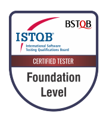

# About Me
- 👋 Hi, I’m @RubaTeixeira
- 🗣️ How to say my name: Robber vall
- 👀 I’m interested in Chatbots, Data Analysis and Quality Assurance.
- 🌱 I'm in a process of continuous learning.

## My history
I worked in customer service for a long time, mainly in technical support. As a result of this experience, in the last company I worked for, I was asked to take part in the smoke test routines for the bank account application. I did the regression test manually, to check the functionality of all the application's functions, especially when there were new features.

From this experience, I ended up becoming interested in the QA routine, which led me to start studying and also to a promotion, so in my most recent routine, I worked with the project team, focusing on the quality of the chatbot's service; looking for flaws and opportunities for improvement, through manual tests, KPI analysis, thus creating new solutions and automation suggestions to increase the bot's retention capacity.

These were enriching experiences that encouraged me to follow a new professional path and brought me here!

## My projects
- [Something about testing](https://github.com/RubaTeixeira/Something-about-testing)
- [Something about data analysis](https://github.com/RubaTeixeira/R_projects)

## Certification

